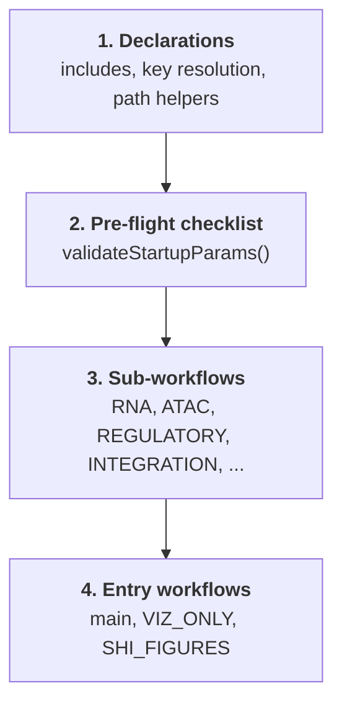
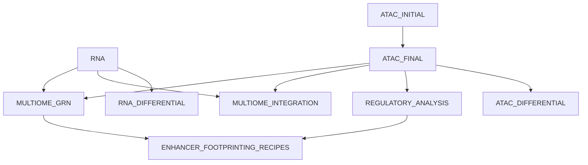

# main.nf architecture

`main.nf` is the pipeline. It is long (~4,200 lines), but it is not complicated —
it is one validation section followed by thirteen workflow blocks wired together
with channels. **You should not need to edit it.** Understanding its shape is
what lets you drive FORGE entirely from a manifest and a dataset config.

This page explains that shape.

---

## The four layers



| Layer | Roughly | What lives there |
|---|---|---|
| Declarations | lines 1–340 | ~108 module `include` statements, cell-type-key resolution, directory/path helper functions |
| Pre-flight | 340–970 | `validateStartupParams()` — all config and manifest validation |
| Sub-workflows | 970–3,310 | The named `workflow` blocks that do the work |
| Entry points | 3,310–4,210 | The unnamed `workflow {}`, plus `VIZ_ONLY` and `SHI_FIGURES`, and the `onComplete` / `onError` handlers |

---

## Layer 2: the pre-flight checklist

Before a single task is submitted, `validateStartupParams()` accumulates **every**
problem it can find and reports them together:

```text
================================================================================
PRE-FLIGHT CHECKLIST FAILED (3 error(s)):
================================================================================
  1. Manifest CSV not found: /path/to/10k_pbmc_manifest.csv
  2. atac.annotation_method='scatanno' requires params.scatanno.reference_atlas
     (path to a .h5ad reference). Set this explicitly in your dataset config.
  3. rna.run=true but the manifest contains no rows with a non-null rna_file.
================================================================================
```

It checks, among other things:

- **Species is set** and consistent with the GTFs and cisTarget references
- **Genome builds agree** across GTF, blacklist, and motif databases
- **Manifest schema** — required columns, unique `sample_id`, per-row file existence
- **Config vs manifest coherence** — asking for an RNA run against an ATAC-only
  manifest is an error
- **Reference files exist** for every enabled module
- **On-ramp bundles are complete** — the Cicero triple and ChromVAR pair are
  all-or-none, and forward-declared-but-unwired keys are rejected if set
- **`resource_tier` is a legal value** — `'Medium'` errors instead of silently
  falling through to `small`

This is FORGE's most useful architectural property for day-to-day work: config
errors cost seconds, not hours. It is also why you can validate a setup with no
containers, no references, and no GPU — see [Verifying FORGE works](../verification.md).

---

## Layer 3: the sub-workflows

Thirteen `workflow` blocks. Each is gated by parameters, so your config decides
which ones materialize.

| Workflow | Gate | Produces |
|---|---|---|
| `RNA` | `rna.run` | CellBender → QC → scVI → scANVI/CellTypist → annotated RNA h5ad; also CellChat and hdWGCNA |
| `RNA_DIFFERENTIAL` | `differential_rna.run` | MAST differential expression per cell type |
| `ATAC_INITIAL` | `atac.run` | First-pass QC; emits QC thresholds |
| `ATAC_FINAL` | `atac.run` | Peak calling, clustering, annotation → peak matrix |
| `ATAC_DIFFERENTIAL` | `differential.run` | Differential accessibility (SnapATAC2) |
| `REGULATORY_ANALYSIS` | `cicero.run`, `chromvar.run`, `scprinter.run` | CCANs, motif deviations, footprints |
| `MULTIOME_INTEGRATION` | `run_multiome_integration` | MOFA+, MultiVI, MuData export |
| `MULTIOME_GRN` | `pycistopic.run`, `scenicplus.run` | Topic models, eRegulons, DORCs |
| `ENHANCER_FOOTPRINTING_RECIPES` | `enhancer_footprinting.run` | Enhancer footprinting recipes A/B/C, strips, cis-rewiring |
| `SHI_FIGURES` | `shi_figures.enabled` | Shi et al. figure suite |
| `VIZ_ONLY` | `-entry VIZ_ONLY` | Re-renders plots from persisted artifacts |

They run in dependency order in the main entry workflow:



Note that the ATAC arm is split in two (`ATAC_INITIAL` → `ATAC_FINAL`) because
QC thresholds are computed from the first pass and fed into the second:

```groovy
ATAC_INITIAL()
ATAC_FINAL(ATAC_INITIAL.out.thresholds)
```

---

## How a manifest row becomes parallel work

This is the mechanism that makes scaling a manifest edit rather than a code edit.

```groovy
Channel.fromPath(params.metadata_file)
    .splitCsv(header: true)      // one map per row
    .map    { trimRow(it) }      // strip whitespace from every field
    .filter { isNonEmptyRow(it) } // drop blank trailing rows
    .filter { isLane(it) }        // route by sample_type
    .map    { row -> tuple(row.sample_id, file("${resolveRnaDir(row)}/${row.rna_file}")) }
```

Each surviving row becomes one tuple in a channel, and each tuple becomes one
task in every per-sample process. Eleven rows produce eleven parallel CellBender
jobs with no code change; one row produces one.

Two helpers make this robust rather than brittle:

- **`trimRow`** trims every field, so a space after a comma cannot break path
  resolution.
- **`resolveRnaDir`** implements the `data_dir` → `params.batch_dirs[batch]`
  fallback described in [the manifest chapter](manifest.md#paths-data_dir-vs-batch_dirs),
  and errors clearly when neither is available.

### Cell-type keys are resolved once, centrally

Different annotation methods write their labels to different `obs` columns. Rather
than scatter that knowledge across modules, `main.nf` resolves it once near the
top and threads the resulting column name through as a value:

```groovy
def cell_type_key = (params.rna?.annotation_method == 'markers')
    ? 'cell_type_marker' : 'cell_type'

def atac_cell_type_key = params.atac.marker_file ? 'cell_type' :
    (params.atac.annotation_method == 'scatanno' ? 'cell_type_prediction'
                                                 : 'celltypist_prediction')
```

!!! note "RNA and ATAC cell types are independent"
    These are two different keys because they come from two different tools on
    two different matrices. FORGE deliberately does **not** transfer RNA labels
    onto ATAC barcodes — ATAC annotation stands on its own so it can be
    validated against the RNA arm rather than assumed to agree with it.

---

## Layer 4: entry points

FORGE has three entry workflows. The default needs no flag:

=== "Full pipeline"

    ```bash
    nextflow run main.nf -profile cluster,singularity -c my_study.config
    ```

    Runs the unnamed `workflow {}` — everything your config enables.

=== "Re-render figures only"

    ```bash
    nextflow run main.nf -entry VIZ_ONLY -c my_study.config
    ```

    Rebuilds QC and Cicero plots from already-persisted artifacts under
    `results/`. Point `params.viz_only.*` at the files to re-read. Cheap, and it
    touches no compute-heavy stage.

=== "Shi et al. figure suite"

    ```bash
    nextflow run main.nf -entry SHI_FIGURES -c my_study.config
    ```

### Completion handlers

`workflow.onComplete` prints a full map of where every output category was
written, and `workflow.onError` prints troubleshooting steps. Both fire whether
the run succeeded or failed — the output-location map at the end of a failed run
is still an accurate guide to where partial results are.

---

## Why you don't edit main.nf

Everything that varies between experiments is a parameter or a manifest row:

| You want to change | Where you change it |
|---|---|
| Number of samples | Add manifest rows |
| Which stages run | `*.run` / `*.enabled` in your dataset config |
| Species or genome | `params.species` and the GTF paths |
| Annotation strategy | `rna.annotation_method`, `atac.annotation_method` |
| Cluster, memory, walltime | Resource tier + profile |
| Skip an expensive stage you already ran | [On-ramps](../onramps.md) |

The cases that genuinely require touching `main.nf` are adding a new tool or
rewiring the DAG. If you find yourself editing it to run your dataset, that is
usually a sign a parameter exists that you have not found — search
`nextflow.config` first.

---

## Where to go next

- [The manifest CSV](manifest.md) — the input contract
- [nextflow.config](config.md) — every gate referenced above
- [On-ramps & resuming](../onramps.md) — injecting intermediates
