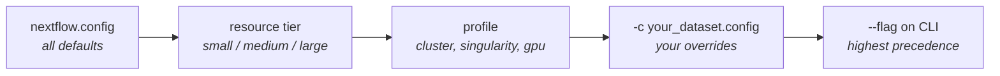

# nextflow.config

`nextflow.config` is where you tell FORGE **what to run** and **how much machine
to give it**. You should almost never edit it. Instead you write a small dataset
config that overrides the handful of parameters your experiment needs, and layer
it on top:

```bash
nextflow run main.nf -profile cluster,singularity -c configs/datasets/my_study.config
```

The repository file holds ~1,000 lines of defaults across 30-odd blocks. This
page explains the layering, the conventions that govern those defaults, and what
each block controls.

---

## How the layers combine

Four things contribute to the final parameter set. Later layers win:



1. **`nextflow.config`** — every default, and the only place a parameter is
   *declared*. A parameter that does not exist here will not be recognized.
2. **Resource tier** — selected by `params.resource_tier`, auto-included from
   `configs/resource_tiers/`. This sets CPU, memory, walltime, and SLURM
   partitions per process.
3. **Profile** — selected with `-profile`, from `configs/profiles/`. Controls
   *where* work runs (local vs SLURM) and how containers are engaged.
4. **Your dataset config** — passed with `-c`. This is the file you write.

!!! warning "`-c` does not replace, it merges"
    A `-c` file overrides only the keys it mentions. Everything else keeps its
    default. This is why dataset configs stay short — and why a typo in a key
    name silently does nothing rather than erroring. When a parameter seems to
    have no effect, check the spelling against `nextflow.config` first.

### Seeing the resolved values

Never guess what a layered config resolved to. Ask Nextflow:

```bash
nextflow -c configs/datasets/my_study.config config -profile cluster,singularity
```

This prints the fully merged configuration and parses in about a second, without
launching anything.

---

## The two conventions that explain most defaults

### 1. Expensive things default to off

Blocks that cost real compute ship disabled, and your dataset config opts in.
You will see this comment throughout:

```groovy
msfp_enabled = false   // golden default; instance configs flip true
```

This is deliberate. The repository default is a run that completes; opting into
footprinting, cis-rewiring, or per-cell-type strips is a decision you make
knowingly. For scale: one process, `ENHANCER_FOOTPRINTING_PER_CT`, accounted for
**54% of all compute** across the four published FORGE datasets.

### 2. Gates nest, and the outer gate wins

Several features sit behind two switches. `msfp_strip.enabled` does nothing
unless `enhancer_footprinting.msfp_enabled` is also `true`, because the strips
render from footprint outputs that the outer gate produces:

```groovy
enhancer_footprinting {
    msfp_enabled = true       // outer gate — produces the footprints
}
msfp_strip {
    enabled = true            // inner gate — renders strips from them
}
```

Turning on only the inner gate is the single most common "why did nothing
happen?" configuration error.

---

## Block reference

### Run-defining — set these first

| Block / key | Default | What it does |
|---|---|---|
| `species` | `null` | **Required.** `'human'` or `'mouse'`. No default on purpose; a wrong genome silently corrupts every downstream result, so FORGE refuses to guess. |
| `metadata_file` | `null` | **Required.** Path to your [manifest CSV](manifest.md). |
| `outdir` | `'results'` | Where published outputs land. |
| `resource_tier` | `'auto'` | `small` \| `medium` \| `large` \| `auto` (alias for `small`). Validated at pre-flight, so `'Medium'` errors rather than silently falling through. |

### Module toggles — what runs at all

| Block | Default | Controls |
|---|---|---|
| `rna.run` | `true` | The whole RNA arm. |
| `atac.run` | `true` | The whole ATAC arm. |
| `run_multiome_integration` | `true` | MOFA+ / MultiVI / MuData export. |
| `cicero.run` | `true` | Co-accessibility (CCANs). |
| `chromvar.run` | `true` | TF motif enrichment. |
| `scprinter.run` | `true` | TF footprinting. |
| `pycistopic.run` / `scenicplus.run` | `true` | Topic modelling and GRN inference. |
| `cellchat.run` / `hdwgcna.run` | `true` | Cell-cell communication, co-expression networks. |
| `differential.run` | `false` | Differential accessibility. Opt-in — needs `condition_group` in the manifest. |
| `differential_rna.run` | `false` | Differential expression (MAST). |
| `dorc.run` | `false` | DORC scoring. |

### RNA arm

| Block | Notable keys | Notes |
|---|---|---|
| `cellbender` | `total_droplets`, `expected_cells`, `fpr`, `epochs` | Ambient RNA correction. `expected_cells` is the one to revisit per chemistry. |
| QC (top-level) | `min_genes` (200), `min_cells` (3), `mt_threshold` (20) | Standard scanpy-style cell/gene filters. |
| Integration (top-level) | `n_epochs_scvi` (50), `scanvi_epochs` (50), `n_top_genes` (4000) | scVI / scANVI training. |
| `rna` | `annotation_method` | `'celltypist'` (default) or `'markers'`. The latter needs `rna.marker_file`. |
| `celltypist` | `model` | Defaults to `Immune_All_Low.pkl` — **change this for non-immune tissue.** |
| `differential_rna` | `condition_key`, `comparisons`, `group_mapping` | MAST differential expression. |

### ATAC arm

| Block | Notable keys | Notes |
|---|---|---|
| `atac` | `min_fragments`, `initial_min_tsse`, `clustering_resolutions`, `peak_fdr` | QC, clustering, peak calling. |
| `atac.annotation_method` | `'scatanno'` — the only supported value | `scatanno` **requires** `scatanno.reference_atlas`; pre-flight enforces this. Setting `atac.marker_file` overrides it with marker mode. There is **no** ATAC CellTypist mode (removed); `params.celltypist` applies to RNA only. |
| `atac.run_mode` | `'broad'` | `'broad'` (~10 classes) or `'fine'` (~30+). Drives per-cell-type granularity downstream. |
| `scatanno` | `reference_atlas`, `distance_threshold`, `uncertainty_threshold` | Reference-based ATAC annotation. |
| `qc.cell_type_resolution` | `min_cells` (50), `min_pct` (0.01) | Universal floor for per-cell-type fan-outs: a cell type is skipped unless it has at least `max(min_cells, min_pct × total)` cells. This exists because tiny cell types can OOM footprinting regardless of their size. |

### Regulatory analysis

| Block | Notable keys | Notes |
|---|---|---|
| `cicero` | `connections_cutoff`, `ccan_min_coaccess`, `plot_windows` | Runs **dataset-global** by default — not per cell type, not condition-aware. |
| `cicero.stratified` | `false` | Per-condition Cicero. Auto-activates when `differential.run = true` and a condition key is set. |
| `cicero_per_ct` | `enabled`, `min_cells_per_stratum` (250) | Per-(cell type × condition) Cicero. The 250-cell stratum floor is separate from `qc.cell_type_resolution`. |
| `chromvar` | `top_n_per_celltype` (5), `min_motif_zscore` (1.5), `global_top_n` (0) | `global_top_n` caps total unique TFs across all cell types — the main lever on footprinting fan-out cost. |
| `scprinter` | `pfms`, `genome`, `target_genes`, `promoter_upstream/downstream` | Footprinting. `printer_name` is species-aware automatically. |
| `pycistopic` | `topics` (`'10,20,30'`), `selected_topics` (`null`), `atac_only` | `topics` is the LDA sweep, one job per count; `selected_topics = null` lets pycisTopic pick the best model. |
| `scenicplus` | `ctx_rankings`, `ctx_scores`, `motif_annotations` | GRN inference. All three cisTarget references are required. |
| `differential_tf` | `mode` | `'descriptive'` (cell type vs rest, works with one condition) or `'differential'` (needs 2+). |

### Footprinting and visualization

| Block | Notable keys | Notes |
|---|---|---|
| `enhancer_footprinting` | `msfp_enabled`, `use_per_ct`, `enhancer_mode`, `build_network` | The expensive one. `use_per_ct = true` collapses ~657 tasks into ~10–33 by loading the printer once per cell type. |
| `msfp_strip` | `enabled`, `mode`, `top_n_regions`, `top_k_genes` | Enhancer-strip target genes are **discovered** per (cell type, TF), not configured. |
| `browser_viz` | `enabled`, `mode`, `window`, `n_bins` | Matplotlib genome browser tracks. |
| `enhancer_viz` | `target_genes`, `normalization`, `condition_col`, `composite_filter` | BigWig export and composite panels. Set `condition_col` for differential browser modes. |
| `promoter_overlay`, `cis_rewiring`, `shi_figures` | `enabled` (all `false`) | Opt-in figure suites. |

### Containers

Container paths are declared once and referenced by every process:

```groovy
containers = [
    scgpu:      "${projectDir}/singularity_cache/scgpu_extended.sif",
    snapatac:   "${projectDir}/singularity_cache/snapatac_extended.sif",
    scenicplus: "${projectDir}/singularity_cache/scenicplus.sif",
    r_cicero:   "${projectDir}/singularity_cache/cicero.sif",
    r_seurat:   "${projectDir}/singularity_cache/seurat_extended.sif",
    r_cellchat: "${projectDir}/singularity_cache/seurat_extended.sif",
]
```

If your `.sif` files live outside the repository, override this map rather than
moving the files. See [Containers](../setup/containers.md).

---

## Profiles

Combine profiles with commas; they are additive.

| Profile | Effect |
|---|---|
| `standard` | Everything runs locally. Useful for parse checks and tiny tests. |
| `cluster` | SLURM executor via `configs/profiles/hpc3_cluster.config`. |
| `gpu` | SLURM with GPU allocation and `accelerator` directives. |
| `singularity` | Enables Singularity/Apptainer with `--nv` for GPU passthrough. |
| `docker` | Enables Docker instead. |

```bash
-profile cluster,singularity     # the normal production combination
```

!!! note "Profiles carry site-specific SLURM settings"
    `hpc3_cluster.config` and the resource tiers encode UCI HPC3 partitions,
    accounts, and QOS names. Running elsewhere means editing these — see
    [Adapting to your cluster](../setup/cluster.md).

---

## Resource tiers

`params.resource_tier` picks one file from `configs/resource_tiers/`:

| Tier | Intended for |
|---|---|
| `small` | ~10k cells, single sample (PBMC-scale). Default via `auto`. |
| `medium` | Mid-scale multi-sample studies. |
| `large` | 100+ samples, 100k+ cells (BD-scale). |

Each tier is a long series of `withName:` blocks setting `cpus`, `memory`,
`time`, and `clusterOptions` per process.

!!! tip "Prefer inline directives over new `withName:` blocks"
    Adding a new `withName:` block to a tier file changes the hash of every
    process below it, which can invalidate cached work on `-resume`. For a
    one-off adjustment, set the directive inline in the module instead.

---

## A complete dataset config

Everything a single-sample human 10x run actually needs:

```groovy
params {
    species       = 'human'
    metadata_file = '/data/pbmc/10k_pbmc_manifest.csv'
    outdir        = 'results_pbmc'
    resource_tier = 'small'

    // References
    gtf_human_full = '/refs/gencode.v38.annotation.gtf'
    blacklist_bed  = '/refs/hg38-blacklist.v2.bed'

    // Annotation — RNA via CellTypist, ATAC via scATAnno (an atlas is required;
    // there is no atlas-free ATAC path)
    celltypist { model = 'Immune_All_Low.pkl' }
    scatanno   { reference_atlas = '/refs/scatanno_pbmc_atlas.h5ad' }

    // Keep the expensive arm off for a first pass
    enhancer_footprinting { msfp_enabled = false }
    scenicplus { run = false }
}
```

Start here, confirm it passes pre-flight, then enable one block at a time.

---

## Where to go next

- [main.nf architecture](architecture.md) — how these parameters gate the DAG
- [On-ramps & resuming](../onramps.md) — skipping stages you have already run
- [Verifying FORGE works](../verification.md) — validating a config in seconds
