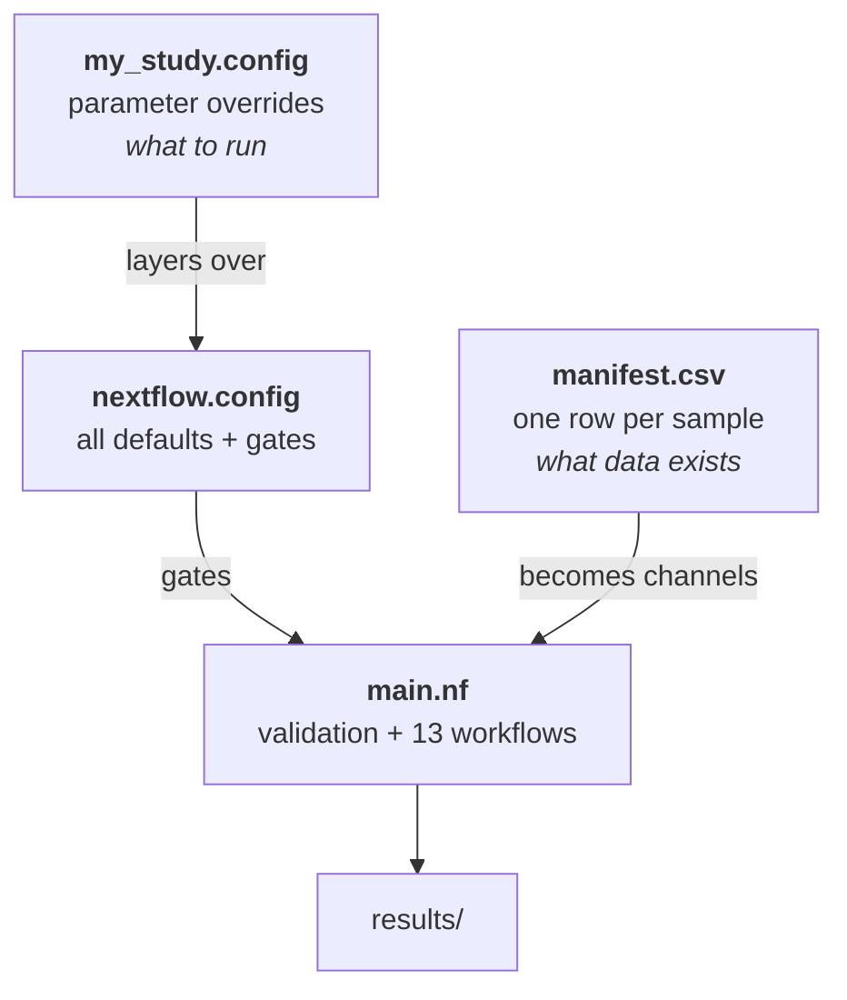

# The three core files

Almost everything you need to know about driving FORGE lives in three files. Two
of them you write; the third you read once and then leave alone.

- **[The manifest CSV](manifest.md)**

    *You write this.* One row per sample. This is how you describe your data to FORGE.
    Adding samples simply means adding rows. Scaling up requires no code changes.

-  **[nextflow.config](config.md)**

    *You override a little of this.* Every parameter default and gate. You write a
    short dataset config that layers on top acting as a mask. You rarely edit the file itself.

- **[main.nf architecture](architecture.md)**

    *You optionally read this.* The heart of the pipeline itself containing its' own structured architecture: validation, thirteen workflow blocks,
    and the channel wiring that turns manifest rows into parallel work.

---

## How they relate

`main.nf` reads the manifest to learn *what* to process and reads the merged
config to learn *whether* and *how* to process it. Both inputs are declarative:
you describe the experiment, and the architecture derives the task graph.

---

## Suggested reading order

1. **[The manifest CSV](manifest.md)** — start here. It is the shortest and easiest place to make a formatting mistake.
2. **[nextflow.config](config.md)** — learn the layering rules and the two
   conventions that explain most defaults. Skim the block reference.
3. **[main.nf architecture](architecture.md)** — Skim through this on your first pass. Return to it if you get stuck troubleshooting something and/or you want to know *why* a stage did or did not run.

Then confirm your understanding.
A 
[pre-flight run](../verification.md#tier-1-pre-flight-and-dag-construction) is quick, computationally inexpensive, and validates a
manifest and config together. You'll even see the constructed process graph.
