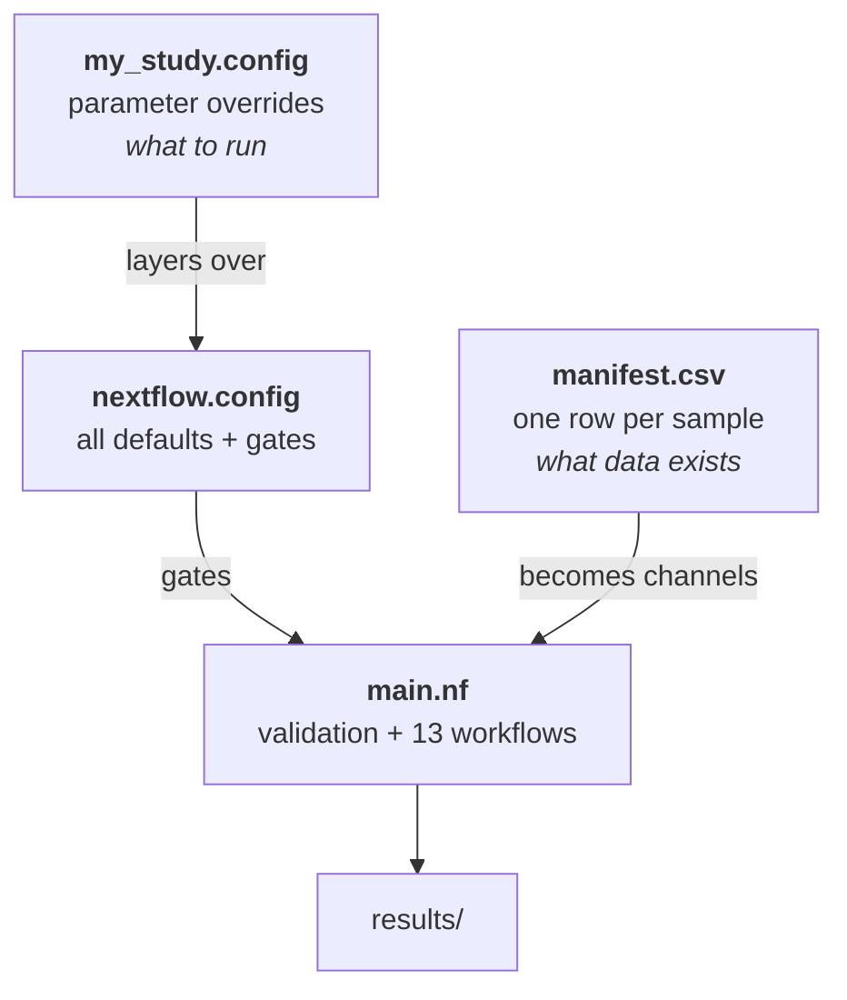

# The three core files

Almost everything you need to know about driving FORGE lives in three files. Two
of them you write; the third you read once and then leave alone.

-   :material-table: **[The manifest CSV](manifest.md)**

    *You write this.* One row per sample — the complete description of your data.
    Adding samples means adding rows, which is why scaling needs no code change.

-   :material-cog: **[nextflow.config](config.md)**

    *You override a little of this.* Every parameter default and gate. You write a
    short dataset config that layers on top; you rarely edit the file itself.

-   :material-sitemap: **[main.nf architecture](architecture.md)**

    *You read this.* The pipeline itself — validation, thirteen workflow blocks,
    and the channel wiring that turns manifest rows into parallel work.

---

## How they relate

`main.nf` reads the manifest to learn *what* to process and reads the merged
config to learn *whether* and *how* to process it. Both inputs are declarative:
you describe the experiment, and the architecture derives the task graph.

---

## Suggested reading order

1. **[The manifest CSV](manifest.md)** — start here. It is the shortest and the
   most likely place to make a mistake that costs you a run.
2. **[nextflow.config](config.md)** — learn the layering rules and the two
   conventions that explain most defaults, then skim the block reference.
3. **[main.nf architecture](architecture.md)** — read once for the shape. Return
   to it when you want to know *why* a stage did or did not run.

Then confirm your understanding cheaply: a
[pre-flight run](../verification.md#tier-1-pre-flight-validation) validates a
manifest and config together in about ten seconds, with no containers and no GPU.
