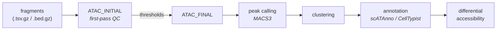

# ATAC arm

The ATAC arm takes fragment files to an annotated peak matrix. It runs in two
passes, because the second pass uses QC thresholds computed from the first.



Enabled with `atac.run = true` (the default).

---

## Why two passes

```groovy
ATAC_INITIAL()
ATAC_FINAL(ATAC_INITIAL.out.thresholds)
```

`ATAC_INITIAL` computes per-sample fragment and TSS-enrichment distributions and
emits data-driven thresholds; `ATAC_FINAL` applies them. This is why the initial
filters are loose and the final ones are `null` by default — the defaults are
*meant* to be derived, not set:

```groovy
atac {
    // First pass — loose, just removes obvious debris
    run_initial_qc     = true
    initial_min_counts = 1000
    initial_min_tsse   = 5
    initial_max_counts = 100000

    // Final pass — null means "use the computed threshold"
    min_counts = null
    min_tsse   = null
    max_counts = null
}
```

Set the final values explicitly only when you want to override the computed
thresholds.

## Peaks and clustering

```groovy
atac {
    n_features             = 50000
    peak_fdr               = 0.05
    clustering_resolutions = [0.5, 1.0, 2.0]
    annotation_resolution  = 'leiden_0_5'   // which resolution annotation uses
    batch_correction       = 'none'
    batch_key              = null
}
```

Multiple clustering resolutions are computed; `annotation_resolution` selects the
one annotation is performed against.

---

## Annotation

!!! important "ATAC annotation is independent of RNA"
    FORGE deliberately does **not** transfer RNA labels onto ATAC barcodes. The
    ATAC arm annotates from accessibility alone, so the two modalities can be
    compared as independent evidence rather than one being assumed from the other.
    This matters for the cross-modal validation step — agreement is a result, not
    a construction.

Three modes:

=== "scATAnno (default)"

    Reference-atlas annotation on the peak matrix directly.

    ```groovy
    atac { annotation_method = 'scatanno' }
    scatanno {
        reference_atlas       = '/refs/atlas.h5ad'   // REQUIRED
        atlas_name            = 'general'
        distance_threshold    = 95
        uncertainty_threshold = 0.5
        n_dims                = 30
        knn_neighbors         = 30
    }
    ```

    Pre-flight fails if `reference_atlas` is unset:

    ```text
    atac.annotation_method='scatanno' requires params.scatanno.reference_atlas
    (path to a .h5ad reference). Set this explicitly in your dataset config.
    ```

    Labels land in `cell_type_prediction`.

=== "CellTypist on gene activity"

    Computes gene activity from accessibility, then applies a CellTypist model.
    No atlas needed — the simplest path to a working run.

    ```groovy
    atac { annotation_method = 'celltypist' }
    celltypist { model = 'Immune_All_Low.pkl' }
    ```

    Labels land in `celltypist_prediction`.

=== "Marker genes"

    Overrides either method above.

    ```groovy
    atac { marker_file = '/path/to/atac_markers.json' }
    ```

    Labels land in `cell_type`.

### Broad versus fine granularity

```groovy
atac {
    run_mode      = 'broad'    // 'broad' (~10 classes) | 'fine' (~30+)
    cell_type_col = null       // override the resolved label column
}
```

`MERGE_ANNOTATIONS` also writes a condensed broad-class column
(`cell_type_broad`) by mapping fine labels through a shared broad map. Downstream
per-cell-type fan-outs are much cheaper at broad resolution — worth using while
you are still iterating.

---

## The per-cell-type resolution floor

Any stage that fans out per cell type enforces a floor:

```groovy
qc {
    cell_type_resolution {
        min_cells = 50
        min_pct   = 0.01
    }
}
```

A cell type is skipped unless it has at least `max(min_cells, min_pct × total)`
cells. This is not merely a statistical nicety: very small cell types have caused
out-of-memory failures in footprinting, because that tool's memory use is driven
by region and mode counts rather than by cell count. A 7-cell cell type can cost
as much as a 7,000-cell one.

## Differential accessibility

```groovy
differential {
    run                 = true
    condition_key       = 'condition_group'
    comparisons         = [['TG', 'WT']]
    cell_types          = []          // empty → all that pass the floor
    control_condition   = 'WT'
    treatment_condition = 'TG'
}
```

Requires two or more `condition_group` values. Enabling this also auto-activates
stratified Cicero — see [Regulatory analysis](regulatory.md).

---

## Outputs

| Path | Contents |
|---|---|
| `results/atac/initial_qc/` | First-pass QC and computed thresholds |
| `results/atac/final/peak_matrix.h5ad` | The annotated peak matrix |
| `results/atac/final/celltype_annotations.json` | Cell-type assignments |
| `results/differential/` | Differential accessibility results |

## See also

- [Regulatory analysis](regulatory.md) — Cicero, ChromVAR, footprinting
- [RNA arm](rna.md)
