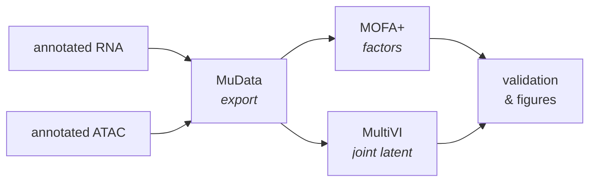

# Multiome integration

Integration joins the independently-processed RNA and ATAC arms into shared
representations.



Enabled with `run_multiome_integration = true` (the default).

---

## Why the arms are annotated separately first

RNA and ATAC are annotated independently, from different tools on different
matrices, and they land in different `obs` columns
([details](../core/architecture.md#cell-type-keys-are-resolved-once-centrally)). FORGE
does not transfer RNA labels onto ATAC barcodes.

That means concordance between the two is a **measurable result** rather than an
artifact of the workflow. Integration compares two independent estimates; it does
not manufacture agreement.

---

## MuData export

```groovy
mudata { batch_size = 10 }
```

Builds the joint `.h5mu` object. `batch_size` controls how many samples are
processed at a time — lower it if this step runs out of memory on a large study.

Barcode formats differ between modalities and platforms (`sample:barcode` versus
`barcode-sample`, and 10x versus BD conventions). FORGE normalizes these when
matching cells across layers. Do not pre-mangle barcodes to try to help it.

## MOFA+

```groovy
mofa {
    run              = true
    mode             = 'high_memory'
    n_factors        = 15
    convergence_mode = 'medium'
    bootstrap { n_iterations = 10; sample_fraction = 0.5 }
}
```

Learns latent factors shared across modalities. The bootstrap block resamples to
assess factor stability — worth keeping, since it is cheap relative to the rest of
the pipeline.

## MultiVI

```groovy
multivi {
    run              = true
    n_epochs         = 200
    batch_key        = 'sample_id'
    modality_weights = 'equal'
    modality_penalty = 'Jeffreys'
    n_latent         = 20
    cell_type_key    = 'cell_type'
    run_imputation   = false
    run_differential = false
}
```

A joint variational model producing a shared latent space, plus optional
imputation of missing modality values. GPU-backed.

!!! note "MultiVI is memory-hungry"
    On large datasets MultiVI has needed very large host-memory allocations —
    substantially more than its GPU memory footprint would suggest. If it fails
    with an out-of-memory or exit code 137, raise host memory rather than GPU
    memory. `run_imputation = true` increases this further.

---

## Outputs

| Path | Contents |
|---|---|
| `results/multiome/mudata/` | The joint `.h5mu` object |
| `results/multiome/mofa/` | Factor matrices, variance explained, loadings |
| `results/multiome/mofa_bootstrap/` | Factor stability results |
| `results/multiome/multivi/` | Trained model and latent representation |
| `results/multiome/multivi/visualizations/` | Latent-space UMAPs |

---

## Skipping integration

If you already have a MuData object, inject it and skip the build:

```groovy
params.onramp { mudata_h5mu = '/prior/results/multiome/mudata/joint.h5mu' }
```

If you are on-ramping an integrated RNA object and still want fresh integration,
you must also supply the per-sample RNA h5ads — the integrated object alone is not
sufficient, and pre-flight will tell you so:

```text
rna_integrated_h5ad onramp + run_multiome_integration=true requires either
rna_per_sample_h5ads_dir (for fresh multiome) or mudata_h5mu (skip multiome).
Set one, or set run_multiome_integration=false.
```

See [On-ramps & resuming](../onramps.md).

## See also

- [RNA arm](rna.md) · [ATAC arm](atac.md)
- [Regulatory analysis](regulatory.md) — GRN inference consumes the joint object
