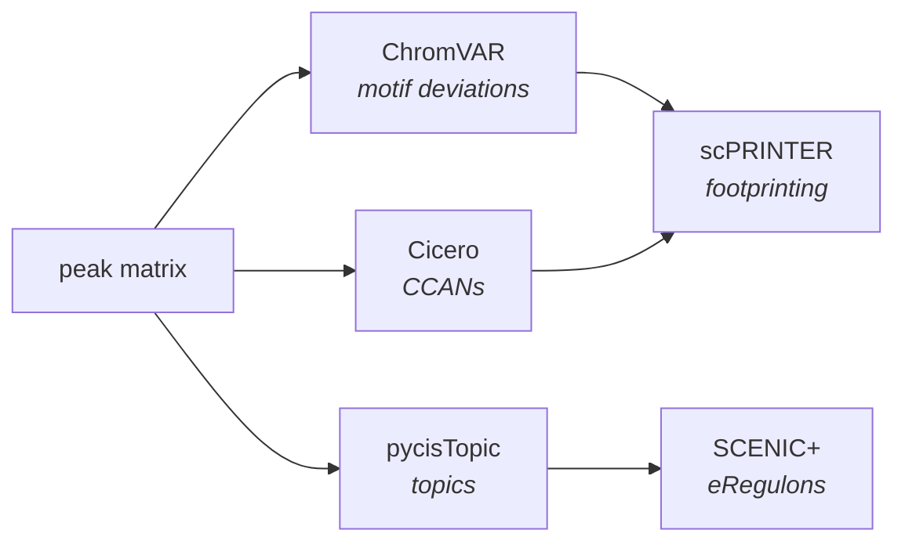

# Regulatory analysis

Co-accessibility, TF motif
enrichment, footprinting, and gene regulatory network inference.



!!! warning "Read the cost model before enabling everything"
    `ENHANCER_FOOTPRINTING_PER_CT` alone was **54% of all compute-hours** across
    the four published FORGE datasets. It ships disabled. See
    [Verifying FORGE works](../verification.md#tier-3-the-published-datasets).

---

## Cicero — co-accessibility

```groovy
cicero {
    run                 = true
    connections_cutoff  = 0.25
    ccan_min_coaccess   = 0.1
    sample_num          = 100
    num_dim             = 50
    target_genes        = []
    plot_windows        = "100000,250000,500000"
    plot_thresholds     = "0.10,0.05,0.025"
    plot_labels         = "strict,permissive,exploratory"
}
```

!!! note "Default Cicero is dataset-global"
    The default run computes **one** co-accessibility map across the whole peak
    matrix. It is not per cell type and not condition-aware. The stratified
    variants below add those axes; they do not replace the global map, and both
    are useful.

### Per-condition (stratified)

Runs Cicero separately per condition, then contrasts the maps:

```groovy
cicero {
    stratified          = true      // auto-on when differential.run = true
    condition_key       = 'condition_group'
    control_condition   = 'WT'
    treatment_condition = 'TG'
}
```

### Per cell type × condition

```groovy
cicero_per_ct {
    enabled               = true
    cell_type_col         = 'cell_type_broad'
    condition_col         = 'condition'
    min_cells             = 50     // cell-type abundance floor
    min_pct               = 0.01
    min_cells_per_stratum = 250    // per-(CT, condition) floor
}
```

`min_cells_per_stratum` is a separate axis from `qc.cell_type_resolution`: a cell
type can clear the global floor and still have too few cells *within one
condition* to fit a model. Strata below 250 cells are skipped and logged.

---

## ChromVAR — motif enrichment

```groovy
chromvar {
    run                = true
    top_n_per_celltype = 5
    min_motif_zscore   = 1.5
    chunk_size         = 30000
    global_top_n       = 0     // 0 = keep all TFs
}
```

GPU-accelerated, using cisBP motifs (`atac.cisbp_human` / `atac.cisbp_mouse`).

`global_top_n` is **the main cost lever for everything downstream**. ChromVAR's
selected TFs determine the footprinting fan-out, so capping total unique TFs
across all cell types directly bounds the most expensive stage. Setting it to a
small number is the cheapest way to make footprinting tractable on a first pass.

## Differential TF accessibility

```groovy
differential_tf {
    run           = true
    mode          = 'descriptive'   // 'descriptive' | 'differential'
    condition_key = 'condition_group'
    cell_types    = ['Microglia', 'Astrocytes']   // required
    comparisons   = [['TG', 'WT']]                // differential mode only
    min_cells     = 50
    fdr_cutoff    = 0.05
}
```

`descriptive` tests each cell type against the rest and works with a single
condition. `differential` contrasts conditions within a cell type and needs two or
more.

---

## scPRINTER — footprinting

```groovy
scprinter {
    run                 = true
    pfms                = '/refs/scprinter/JASPAR2022_core_nonredundant.jaspar'
    genome              = 'hg38'
    target_genes        = ['APOE', 'TREM2']
    cache_dir           = '/refs/scprinter'
    promoter_upstream   = 2000
    promoter_downstream = 500
    fdr_threshold       = 0.05
}
```

`printer_name` is derived from `params.species` automatically, so mouse runs
produce `mouse_scprinter.h5ad`.

## Enhancer footprinting recipes

The expensive layer. Two gates:

```groovy
enhancer_footprinting {
    run           = true      // recipe scaffolding
    msfp_enabled  = false     // ← the real cost switch
    use_per_ct    = true
    enhancer_mode = 'ccan'    // 'ccan' | 'pairwise_95'
    build_network = false
}
```

- **`msfp_enabled`** gates the multi-scale footprinting compute and every
  downstream consumer (TF-gene networks, aggregate stats, cross-modal validation,
  composite figures, promoter overlays). Cicero, bigWig export, and cis-rewiring
  run regardless.
- **`use_per_ct = true`** loads the printer and peak matrix once per cell type
  instead of once per (cell type, TF), collapsing roughly 657 tasks into 10–33.
  Leave it on.

### Enhancer strips

```groovy
enhancer_footprinting { msfp_enabled = true }   // outer gate
msfp_strip {
    enabled       = true                        // inner gate
    mode          = 'all_three'
    top_n_regions = 100
    top_k_genes   = 5
}
```

Strip target genes are **discovered**, not configured: `RANK_ENHANCER_STRIP_GENES`
ranks candidates per (cell type, TF) from TF binding scores crossed with Cicero
co-accessibility, so every rendered strip has evidence behind it. `top_n_regions`
and `top_k_genes` bound that search.

!!! failure "Enabling only the inner gate"
    `msfp_strip.enabled = true` with `msfp_enabled = false` produces nothing and
    no error. The strips attempt to render from footprints that were never computed. This is a common configuration mistake in FORGE.

---

## pycisTopic and SCENIC+

```groovy
pycistopic {
    run             = true
    atac_only       = false      // true → build metadata from ATAC, no RNA needed
    topics          = '10,20,30' // LDA sweep: one job per topic count
    selected_topics = null       // null → pycisTopic picks the best model
    min_cells       = 100
    gtf             = '/refs/gencode.gtf'
    blacklist_bed   = '/refs/blacklist.bed'
}

scenicplus {
    run               = true
    ctx_rankings      = '/refs/cistarget/rankings.feather'
    ctx_scores        = '/refs/cistarget/scores.feather'
    motif_annotations = '/refs/cistarget/motifs.tbl'
    gtf               = '/refs/gencode.gtf'
    fai               = '/refs/genome.fa.fai'
}
```

pycisTopic runs in three phases — per-group object construction, a parallel LDA
sweep, then model selection and binarization. Leaving `selected_topics = null`
lets `evaluate_models()` choose from the sweep, which is what you want unless you
are reproducing a specific prior result.

SCENIC+ requires all three cisTarget references and is the most memory-hungry
stage in the pipeline (≥ 256 GB). It also requires `pycistopic.run = true`.

---

## Outputs

| Path | Contents |
|---|---|
| `results/cicero/` | Connections, CCAN assignments, ordered CDS |
| `results/chromvar/` | Deviation matrix, per-cell-type TF rankings |
| `results/scprinter/` | Footprints, binding scores, TF-gene networks |
| `results/multiome/` | Topic models, eRegulons, DORC scores |

## See also

- [Visualization](visualization.md) — rendering these results
- [On-ramps](../onramps.md) — reusing Cicero or ChromVAR results across runs
