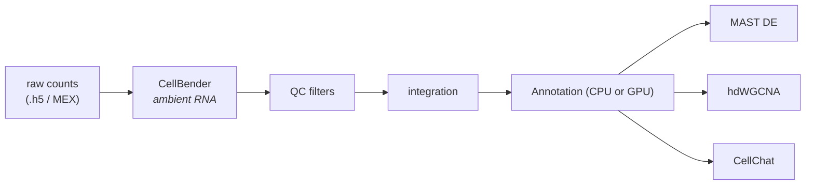

# RNA arm

The RNA arm takes raw count matrices to an integrated, annotated object, then
optionally runs differential expression, co-expression networks, and cell-cell
communication.



Enabled with `rna.run = true` (the default).

---

## Ambient RNA correction

```groovy
cellbender {
    total_droplets      = 20000
    expected_cells      = 5000
    fpr                 = 0.01
    epochs              = 150
    low_count_threshold = 0
}
```

`expected_cells` is the parameter to revisit per experiment — set it near your
expected recovery. `total_droplets` should comfortably exceed it. CellBender uses
a GPU.

## QC

```groovy
min_genes    = 200   // minimum genes per cell
min_cells    = 3     // minimum cells per gene
mt_threshold = 20    // max % mitochondrial reads
```

These are deliberately permissive. Tighten them after inspecting the QC plots
under `results/rna_qc/` rather than before.

## Integration

```groovy
n_epochs_scvi = 50
scanvi_epochs = 50
n_top_genes   = 4000
```

scVI corrects batch effects across samples; the batch axis comes from the
manifest's `batch` column. For a single-sample dataset this is effectively a
denoising step.

---

## Annotation

Three strategies, selected with `rna.annotation_method`:

=== "CellTypist (default)"

    Reference-model CPU-based annotation. Fast, and needs no atlas download beyond the model.

    ```groovy
    rna { annotation_method = 'celltypist' }
    celltypist { model = 'Immune_All_Low.pkl' }
    ```

    !!! warning "Change the model for non-immune tissue"
        `Immune_All_Low.pkl` is the default and is wrong for most tissues. For
        adult mouse brain, for example, use `Mouse_Whole_Brain.pkl`. A mismatched
        model produces confident, plausible, incorrect labels.

=== "scANVI (recommended)"

    Reference-model GPU-based annotation. If a reference atlas directory is configured (`ref_dir_human_integrated` /`ref_dir_mouse_integrated`), FORGE runs GPU-based scANVI for label transfer.

    ```groovy
    rna { annotation_method = 'celltypist' }
    celltypist { model = 'Immune_All_Low.pkl' }
    ```

=== "Marker genes"

    Score-based annotation from your own marker sets — full control, useful when
    you prefer explicit user-definitions of expression profiles.

    ```groovy
    rna {
        annotation_method   = 'markers'
        marker_file         = '/path/to/markers.json'
        marker_min_score    = 0.0   // below this → 'unknown'
        marker_score_margin = 0.1   // min top-vs-second gap
    }
    ```

    `marker_score_margin` guards against near-ties: when the best and
    second-best scores are within the margin, the call collapses to `unknown`
    rather than picking arbitrarily.

With no atlas it takes the CellTypist-only path. We anectdotally note the best performance with scANVI and thus we recommend it over CellTypist for annotation trustworthiness. However, we provide the more accessible CellTypist as the default since it does not require a GPU, has a lower compute burden, and pre-loads various models immediately ready for use.

Annotation labels land in the `obs` column that `main.nf` resolves centrally —
`cell_type` normally, `cell_type_marker` in marker mode. See
[main.nf architecture](../core/architecture.md#cell-type-keys-are-resolved-once-centrally).

---

## Differential expression

```groovy
differential_rna {
    run               = true
    condition_key     = 'condition_group'
    cell_type_key     = 'cell_type'
    comparisons       = [['TG', 'WT']]     // [treatment, control]
    run_go_enrichment = true
    pval_cutoff       = 0.05
    log2fc_cutoff     = 0.25
}
```

Uses MAST, per cell type. Requires at least two distinct `condition_group` values
in the manifest. The pre-flight checklist enforces this.

A positive `log2FC` means up in the **treatment** condition, matching the
`<treatment>_vs_<control>` naming of the output files.

## Co-expression networks

```groovy
hdwgcna {
    run                 = true
    cell_type_key       = 'cell_type'
    min_cells           = 100          // skip cell types below this
    condition_key       = 'condition_group'
    control_condition   = 'WT'
    treatment_condition = 'TG'
    traits              = []
}
```

By default:
- **Tier 1** (network construction per cell type) always runs. 
- **Tier 2** (differential module eigengene testing and module-trait correlation) activates when you set the condition keys.

## Cell-cell communication

```groovy
cellchat {
    run           = true
    cell_type_key = 'cell_type'
    condition_key = 'condition_group'
    conditions    = ['WT', 'TG']    // set → per-condition + comparative analysis
}
```

With `conditions` empty, CellChat runs once globally. Populate it to get
per-condition networks plus a comparative analysis.

---

## Outputs

| Path | Contents |
|---|---|
| `results/cellbender/` | Correction reports per sample |
| `results/rna_qc/` | Per-sample QC'd h5ads and plots |
| `results/integration/` | Integrated, annotated RNA object |
| `results/rna_differential/` | MAST results, optional GO enrichment |
| `results/hdwgcna/` | Modules, eigengenes, DME results |
| `results/cellchat/` | Interaction networks |

## See also

- [ATAC arm](atac.md) — annotated independently, then reconciled
- [Multiome integration](integration.md) — joining the two modalities
