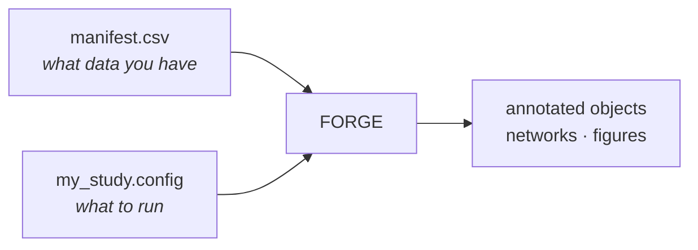

# FORGE

**FORGE** is a Nextflow pipeline for end-to-end analysis of single-cell and
single-nucleus multiome (RNA + ATAC) data on HPC infrastructure. It integrates
ambient RNA correction, QC, clustering, reference-based cell-type annotation,
co-accessibility inference, TF motif enrichment, footprinting, gene regulatory
network reconstruction, and multi-modal visualization into one reproducible
workflow.

Developed at the [Swarup Lab](https://swaruplab.bio.uci.edu/), University of
California, Irvine.

---

## The idea

You describe your experiment in **two files** — a manifest CSV and a dataset
config — and the pipeline architecture handles the rest: parallelism across
samples, resource allocation per stage, container selection, checkpointing, and
which of ~108 processes actually need to run.



Scaling from one sample to eleven is adding rows to the manifest. Turning a stage
on or off is one line in the config. Neither requires touching pipeline code.

---

## Start here

<div class="grid cards" markdown>

-   :material-rocket-launch: **[Quickstart](quickstart.md)**

    One linear walkthrough, start to finish.

-   :material-check-decagram: **[Verifying FORGE works](verification.md)**

    Validate a setup in ~10 seconds, with no containers or GPU.

-   :material-file-document-multiple: **[The three core files](core/index.md)**

    The manifest, the config, and the architecture — what to actually learn.

-   :material-download: **[Installation](setup/install.md)**

    Containers, references, and cluster setup.

</div>

---

## Pipeline overview

```text
Raw 10x/BD data
  │
  ├─ RNA arm ──────────────────────────────────────────────────────────────────┐
  │   CellBender → RNA QC → scVI → scANVI + CellTypist → DE (MAST) → hdWGCNA  │
  │                                                                            │
  ├─ ATAC arm ─────────────────────────────────────────────────────────────────┤
  │   SnapATAC2 QC → peak calling → scATAnno / CellTypist annotation           │
  │   → Cicero (CCANs) → ChromVAR (GPU) → SCENIC+/pycisTopic (GRN)            │
  │   → scPRINTER (TF footprinting at enhancers)                               │
  │                                                                            │
  ├─ Multiome integration ─────────────────────────────────────────────────────┤
  │   MOFA+ → MultiVI → MuData export                                          │
  │                                                                            │
  └─ Communication & visualization ───────────────────────────────────────────┘
      CellChat → enhancer footprinting recipes (A/B/C) → genome browser tracks
```

---

## Capabilities

| Stage | Tools |
|-------|-------|
| Ambient RNA correction | CellBender |
| RNA QC, integration, batch correction | scanpy, scVI |
| Reference-based annotation (RNA) | scANVI, CellTypist |
| ATAC QC, peak calling, clustering | SnapATAC2 |
| Reference-based annotation (ATAC) | scATAnno |
| Co-accessibility networks | Cicero (R) |
| TF motif enrichment | ChromVAR (GPU-accelerated, cisBP) |
| Gene regulatory networks | SCENIC+ / pycisTopic |
| TF footprinting at enhancers | scPRINTER (JASPAR 2022) |
| RNA co-expression networks | hdWGCNA |
| Cell-cell communication | CellChat |
| Multi-modal integration | MOFA+, MultiVI |
| Differential expression | MAST |
| Differential accessibility | SnapATAC2 |

## Supported genomes

| Assembly | Species | Annotation |
|----------|---------|------------|
| GRCh38 (hg38) | Human | Gencode v38 |
| GRCm38 (mm10) | Mouse | Gencode vM10 |
| GRCm39 (mm39) | Mouse | Gencode vM37 |

---

## Requirements

- [Nextflow](https://www.nextflow.io/) ≥ 23.04
- [Singularity](https://sylabs.io/singularity/) or [Apptainer](https://apptainer.org/) ≥ 3.8
- SLURM-managed HPC cluster
- NVIDIA GPU (A30 or equivalent) — for CellBender, scVI/scANVI, ChromVAR, MOFA+, MultiVI
- High-memory nodes (≥ 256 GB) — for SCENIC+ and large reference atlases
- ~600 GB disk for reference files

!!! tip "You can validate a configuration without any of this"
    Pre-flight validation needs only Nextflow. See
    [Verifying FORGE works](verification.md).

---

## Citation

> Solano LE, Swarup V, et al. FORGE: a Nextflow pipeline for end-to-end
> single-cell multiomics analysis. *[manuscript in preparation]*, 2026.

Licensed BSD 3-Clause. Contact: Luis Enrique Solano · lesolano@uci.edu
