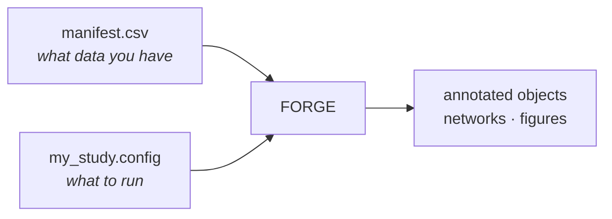

# FORGE

**FORGE** is a Nextflow pipeline for end-to-end analysis of single-cell and
single-nucleus multiome (RNA + ATAC) data on HPC infrastructure. It integrates
ambient RNA correction, QC, clustering, reference-based cell-type annotation,
co-accessibility inference, TF motif enrichment, footprinting, gene regulatory
network reconstruction, and multi-modal visualization into one reproducible
workflow.

Developed at the [Swarup Lab](https://swaruplab.bio.uci.edu/), University of
California, Irvine.

---

## The idea

You describe your experiment in **two files** — a manifest CSV and a dataset
config — and the pipeline architecture handles the rest: parallelism across
samples, resource allocation per stage, container selection, checkpointing, and
which of ~108 processes actually need to run.



Scaling from one sample to eleven is adding rows to the manifest. Turning a stage
on or off is one line in the config. Neither requires touching pipeline code.

---

## Start here

<div class="grid cards" markdown>

-   :material-rocket-launch: **[Quickstart](quickstart.md)**

    One linear walkthrough, start to finish.

-   :material-check-decagram: **[Verifying FORGE works](verification.md)**

    Validate a setup in ~10 seconds, with no containers or GPU.

-   :material-file-document-multiple: **[The three core files](core/index.md)**

    The manifest, the config, and the architecture — what to actually learn.

-   :material-download: **[Installation](setup/install.md)**

    Containers, references, and cluster setup.

</div>

---

## Pipeline overview

```text
Raw 10x/BD data
  │
  ├─ RNA arm ──────────────────────────────────────────────────────────────────┐
  │   CellBender → RNA QC → scVI → scANVI + CellTypist → DE (MAST) → hdWGCNA  │
  │                                                                            │
  ├─ ATAC arm ─────────────────────────────────────────────────────────────────┤
  │   SnapATAC2 QC → peak calling → scATAnno / CellTypist annotation           │
  │   → Cicero (CCANs) → ChromVAR (GPU) → SCENIC+/pycisTopic (GRN)            │
  │   → scPRINTER (TF footprinting at enhancers)                               │
  │                                                                            │
  ├─ Multiome integration ─────────────────────────────────────────────────────┤
  │   MOFA+ → MultiVI → MuData export                                          │
  │                                                                            │
  └─ Communication & visualization ───────────────────────────────────────────┘
      CellChat → enhancer footprinting recipes (A/B/C) → genome browser tracks
```

---

## Capabilities

| Stage | Tool | Docs | Paper |
|-------|------|------|-------|
| Ambient RNA correction | CellBender | [docs](https://cellbender.readthedocs.io/) | [Fleming et al. 2023, *Nat Methods*](https://doi.org/10.1038/s41592-023-01943-7) |
| RNA QC, clustering | scanpy | [docs](https://scanpy.readthedocs.io/) | [Wolf et al. 2018, *Genome Biol*](https://doi.org/10.1186/s13059-017-1382-0) |
| RNA integration, batch correction | scVI | [scvi-tools](https://docs.scvi-tools.org/) | [Lopez et al. 2018, *Nat Methods*](https://doi.org/10.1038/s41592-018-0229-2) |
| Reference-based annotation (RNA) | scANVI | [scvi-tools](https://docs.scvi-tools.org/) | [Xu et al. 2021, *Mol Syst Biol*](https://doi.org/10.15252/msb.20209620) |
| Reference-based annotation (RNA) | CellTypist | [celltypist.org](https://www.celltypist.org/) | [Domínguez Conde et al. 2022, *Science*](https://doi.org/10.1126/science.abl5197) |
| ATAC QC, peak calling, clustering | SnapATAC2 | [docs](https://kzhang.org/SnapATAC2/) | [Zhang et al. 2024, *Nat Methods*](https://doi.org/10.1038/s41592-023-02139-8) |
| Reference-based annotation (ATAC) | scATAnno | [PyPI](https://pypi.org/project/scATAnno/) | [Jiang et al. 2025, *Genom Proteom Bioinform*](https://doi.org/10.1093/gpbjnl/qzaf108) |
| Co-accessibility networks | Cicero | [docs](https://cole-trapnell-lab.github.io/cicero-release/) | [Pliner et al. 2018, *Mol Cell*](https://doi.org/10.1016/j.molcel.2018.06.044) |
| TF motif enrichment | chromVAR | [docs](https://greenleaflab.github.io/chromVAR/) | [Schep et al. 2017, *Nat Methods*](https://doi.org/10.1038/nmeth.4401) |
| Gene regulatory networks | SCENIC+ | [docs](https://scenicplus.readthedocs.io/) | [Bravo González-Blas et al. 2023, *Nat Methods*](https://doi.org/10.1038/s41592-023-01938-4) |
| Topic modelling of ATAC | pycisTopic | [docs](https://pycistopic.readthedocs.io/) | [Bravo González-Blas et al. 2023, *Nat Methods*](https://doi.org/10.1038/s41592-023-01938-4) |
| TF footprinting at enhancers | scPRINTER | [GitHub](https://github.com/buenrostrolab/scPrinter) | [Hu et al. 2025, *Nature*](https://doi.org/10.1038/s41586-024-08443-4) |
| RNA co-expression networks | hdWGCNA | [docs](https://smorabit.github.io/hdWGCNA/) | [Morabito et al. 2023, *Cell Rep Methods*](https://doi.org/10.1016/j.crmeth.2023.100498) |
| Cell–cell communication | CellChat | [GitHub](https://github.com/jinworks/CellChat) | [Jin et al. 2021, *Nat Commun*](https://doi.org/10.1038/s41467-021-21246-9) |
| Multi-modal integration | MOFA+ | [docs](https://biofam.github.io/MOFA2/) | [Argelaguet et al. 2020, *Genome Biol*](https://doi.org/10.1186/s13059-020-02015-1) |
| Multi-modal integration | MultiVI | [scvi-tools](https://docs.scvi-tools.org/) | [Ashuach et al. 2023, *Nat Methods*](https://doi.org/10.1038/s41592-023-01909-9) |
| Differential expression | MAST | [GitHub](https://github.com/RGLab/MAST) | [Finak et al. 2015, *Genome Biol*](https://doi.org/10.1186/s13059-015-0844-5) |
| Differential accessibility | SnapATAC2 | [docs](https://kzhang.org/SnapATAC2/) | [Zhang et al. 2024, *Nat Methods*](https://doi.org/10.1038/s41592-023-02139-8) |

**Motif databases.** Footprinting scores against
[JASPAR 2022](https://jaspar.elixir.no/)
([Castro-Mondragon et al. 2022, *NAR*](https://doi.org/10.1093/nar/gkab1113));
motif enrichment uses [CIS-BP](https://cisbp.ccbr.utoronto.ca/)
([Weirauch et al. 2014, *Cell*](https://doi.org/10.1016/j.cell.2014.08.009)).

## Validated genomes

These are the assemblies FORGE has been run and validated against. They are not
a whitelist — the pipeline takes genome, annotation, and motif resources as
configurable paths, so other assemblies work once you supply the matching
reference set. See [Reference files](setup/references.md) for what a new
assembly needs.

| Assembly | Species | Annotation |
|----------|---------|------------|
| GRCh38 (hg38) | Human | Gencode v38 |
| GRCm38 (mm10) | Mouse | Gencode vM10 |
| GRCm39 (mm39) | Mouse | Gencode vM37 |

---

## Requirements

- [Nextflow](https://www.nextflow.io/) ≥ 23.04
- [Singularity](https://sylabs.io/singularity/) or [Apptainer](https://apptainer.org/) ≥ 3.8
- SLURM-managed HPC cluster
- **GPU — optional.** FORGE runs CPU-only end to end. See the GPU tiers below.
- High-memory nodes (≥ 256 GB) — for SCENIC+ and large reference atlases
- ~600 GB disk for reference files

### GPU tiers

FORGE is CPU-only by default and no stage *requires* a GPU to produce results —
the [tutorial](tutorial.md) completes the full 94-task pipeline without one. Where
a GPU is available, these are the stages that use it:

| Tier | Stages | Notes |
|---|---|---|
| **A30-class** (≥ 24 GB VRAM) | `TRAIN_SCVI`, `TRAIN_SCANVI` | The only genuine A30 requirement. Latent-space training on full atlases exhausts smaller cards. |
| **V100-class** (16 GB VRAM) | `CELLBENDER`, `GPU_CHROMVAR`, `MULTIVI_*`, `MOFA_INTEGRATE` | Ample at these sizes; the shipped resource tiers already pin V100 for most MultiVI processes. |
| **CPU-only** | everything else (~100 of ~108 processes) | No GPU code path at all. |

Set `params.slurm_gpu_type` to whatever your site provides — see
[Adapting to your cluster](setup/cluster.md) for the `--gres` syntax.

!!! tip "You can validate a configuration without any of this"
    Pre-flight validation needs only Nextflow. See
    [Verifying FORGE works](verification.md).

---

## Citation

> Solano LE, Swarup V, et al. Flow Orchestrated Regulatory Genomics Engine
> (FORGE): A Configurable Nextflow Pipeline for End-to-End snMultiome
> Analysis. *[manuscript in preparation]*, 2026.

Licensed BSD 3-Clause. Contact: Luis Enrique Solano · lesolano@uci.edu
