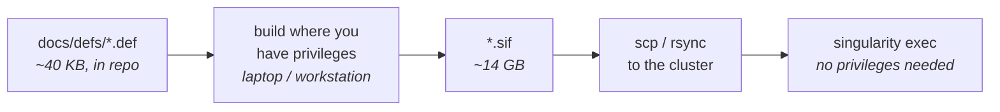

# FORGE containers

This document describes the five Singularity/Apptainer containers used by the
FORGE single-cell multiomics pipeline (Swarup Lab, UCI). It is intended for
power users on HPC clusters who want to extend or rebuild the containers from
scratch.

> **Canonical build recipes** live in [`docs/defs/`](https://github.com/swaruplabUCI/FORGE/tree/main/docs/defs) — five Singularity
> definition files, one per container. Build with `singularity build --fakeroot
> <name>.sif docs/defs/<name>.def`, or use the `hpc_defs/BUILD_ON_HPC.sh` wrapper
> to build them all with logging and a SHA256 manifest.
>
> Every version pin, GitHub commit, and pitfall in this doc is reproduced from
> those `.def` files and the v3.4 build logs (`scgpu_build.log`,
> `seurat_build.log`, `next_build.log`) — the `.def` files remain the
> authoritative recipes. `mac_build_containers.sh` runs those same builds inside
> a Lima VM, which is how you build on a laptop when your cluster forbids it, and
> how you build **your own custom containers to extend FORGE**.

## Three artifacts, three very different sizes

It helps to be precise about what "container" refers to, because only one of
these three things is large enough to be a distribution problem:

| Artifact | What it is | Size | Distribution |
|---|---|---|---|
| **Recipe** (`.def`) | A Singularity definition file — plain text listing the base image, packages, and version pins. The authoritative source. | **4–17 KB** | **Ships in this repository**, under [`docs/defs/`](https://github.com/swaruplabUCI/FORGE/tree/main/docs/defs) |
| **Image** (`.sif`) | The built, immutable single-file image that Singularity executes. Produced from the recipe. | **1.8–4.7 GB each, ~14 GB total** | Too large for git; distributed as a download or built by you |
| **Container** | The running instance Singularity creates from the image at exec time. | n/a | Not an artifact — created and discarded per task |

The practical consequence is good news: **FORGE's containers are fully
reproducible from ~40 KB of text in this repository.** You never need to obtain a
prebuilt image if you can build one yourself.

### If you lack root or `--fakeroot`

Building a `.sif` requires root or `--fakeroot`, and many HPC sites restrict
both. You have two good options:

1. **Ask your HPC administrators to run the build.** The recipes are small,
   self-contained, and auditable, which is usually all an admin needs to approve
   and run `singularity build` on your behalf. Point them at
   [`docs/defs/`](https://github.com/swaruplabUCI/FORGE/tree/main/docs/defs) and [`hpc_defs/BUILD_ON_HPC.sh`](#build-commands).
2. **Build somewhere you do have privileges, then copy the image over.** A `.sif`
   is a self-contained file, and *running* one needs no elevated privileges:



!!! warning "Your build environment must mimic your cluster's Linux environment"
    A `.sif` is portable across Linux hosts of the **same CPU architecture**, so
    a local build has to target what your HPC actually runs — in practice
    `x86-64` Linux. Check with `uname -m` on a cluster node before you start.
    On Linux with `--fakeroot`, this is automatic. On macOS you build inside a
    Linux VM, and on Apple Silicon that VM must run x86-64 under emulation —
    which is precisely what `mac_build_containers.sh` sets up (Lima + Apptainer,
    with Rosetta on Apple Silicon). A natively-built `arm64` image will not run
    on an `x86-64` cluster.

## Container overview

| Container                  | Size  | Base image                                   | Purpose                                                        |
| -------------------------- | ----- | -------------------------------------------- | -------------------------------------------------------------- |
| `scgpu_extended.sif`       | 3.7 G | `ghcr.io/scverse/scvi-tools:py3.11-cu12-base`| scVI / scANVI, CellBender, CellTypist, scrublet, MOFA+, muon   |
| `snapatac_extended.sif`    | 4.7 G | `python:3.10-slim`                           | SnapATAC2, scPrinter, scATAnno, MACS3, cupy/rmm, deeptools     |
| `seurat_extended.sif`      | 2.3 G | `rocker/r-ver:4.4.3`                         | Seurat 5, hdWGCNA (+ ggforestplot), CellChat, MAST + edgeR, WGCNA, zellkonverter (+ baked basilisk env) |
| `cicero.sif`               | 1.9 G | `condaforge/mambaforge:latest`               | R + Cicero (via Monocle3), Bioconductor, rtracklayer, Gviz     |
| `scenicplus.sif`           | 1.8 G | `python:3.11.8-slim`                         | SCENIC+, pycisTopic, pySCENIC, Mallet, graph-tool              |

Sizes above are the actual `.sif` sizes of the canonical set: cicero,
scgpu, snapatac, scenicplus from `sif_output/` (v3.4), and seurat from the
v3.6 clean rebuild (basilisk env baked via `BASILISK_USE_SYSTEM_DIR=1`,
plus edgeR, ggforestplot, and the Deriv 4.1.6 pin). Build dates: cicero
2026-03-12, seurat 2026-09-03 (v3.6), scgpu 2026-03-17 (CellBender fix),
scenicplus 2026-03-30, snapatac 2026-04-08 (scATAnno).

## Build system

Each container has a standalone Singularity definition file under
[`docs/defs/`](https://github.com/swaruplabUCI/FORGE/tree/main/docs/defs). The recommended path is:

```bash
# On an HPC compute node (NOT a login node)
srun --partition=free --time=04:00:00 --mem=24G --cpus-per-task=8 --pty bash
module load singularity     # or: module load apptainer
cd /path/to/forge

# Build all five with --fakeroot, log per container, summarize at the end:
bash hpc_defs/BUILD_ON_HPC.sh all

# Or a single container:
bash hpc_defs/BUILD_ON_HPC.sh seurat_extended
```

For each container, the wrapper runs `singularity build --fakeroot
<name>.sif docs/defs/<name>.def` (falling back to an unprivileged build if
`--fakeroot` is unavailable), captures stdout+stderr to
`singularity_cache/build_logs/`, and at the end prints a results table plus
a SHA256 manifest you can diff against the expected hashes (see
"Verifying a build" below).

A Mac builder is also available — `mac_build_containers.sh` provisions a
Lima VM and runs the same `.def` builds inside it. This is convenient for
preparing `.sif` files on a laptop, then `scp`-ing to HPC. The recipes are
identical; only the host orchestration differs.

### Build order

Cicero is built first in the `all` target because its mamba solve is the
longest single step (and is most likely to expose disk-space or networking
issues early):

```
cicero → scgpu_extended → snapatac_extended → seurat_extended → scenicplus
```

There are no inter-container dependencies — any one container can be rebuilt
in isolation. The order is purely a matter of failing-fast on the slowest
solve.

### Build prerequisites

- macOS (any architecture; Apple Silicon uses Rosetta x86_64 emulation
  automatically) **or** a Linux x86_64 build host with `apptainer >= 1.4`
  and `--fakeroot` support.
- Homebrew and Lima on macOS (the script installs both if missing).
- ~80 GB free disk for the Lima VM image plus another ~15 GB for the
  combined `.sif` output.
- Network access to: `ghcr.io`, `quay.io`, `docker.io`, `cran.r-project.org`,
  `bioconductor.org`, `pypi.org`, `download.pytorch.org`, `github.com`,
  `conda-forge`.

### Build times (observed)

These are wall-clock times on an Apple Silicon Mac (M-series, 16 GB host
RAM, Rosetta x86_64 emulation):

| Container                | First build | Rebuild (cached base) |
| ------------------------ | ----------- | --------------------- |
| `cicero.sif`             | ~30–45 min  | ~25 min               |
| `scgpu_extended.sif`     | ~20–30 min  | ~15 min               |
| `snapatac_extended.sif`  | ~25–35 min  | ~20 min               |
| `seurat_extended.sif`    | ~50–70 min  | ~45 min               |
| `scenicplus.sif`         | ~20–30 min  | ~15 min               |

Native x86_64 Linux builds are ~2–3× faster than Apple Silicon under
Rosetta.

---

## 1. `scgpu_extended.sif`

GPU Python container: scVI/scANVI, CellBender, CellTypist, scrublet, MOFA+
(Python side), muon, scanpy.

### Resolved versions (from `scgpu_build.log`, 2026-03-13)

| Package         | Version            |
| --------------- | ------------------ |
| scvi-tools      | 1.4.2              |
| cellbender      | 0.3.2 (commit `4334e89`) |
| muon            | 0.1.7              |
| mudata          | 0.3.3              |
| mofapy2         | 0.7.3              |
| mofax           | (PyPI latest)      |
| celltypist      | 1.7.1              |
| scrublet        | 0.2.3              |
| scanpy          | 1.11.5             |
| anndata         | 0.12.10            |
| torch           | 2.4.0+cu121        |
| numpy           | 2.1.0 (from base)  |

### Definition file

The full recipe is in [`docs/defs/scgpu_extended.def`](https://github.com/swaruplabUCI/FORGE/blob/main/docs/defs/scgpu_extended.def). Build with:

```bash
singularity build --fakeroot scgpu_extended.sif docs/defs/scgpu_extended.def
```

### Pitfalls

- **CellBender 0.3.2 from PyPI is broken on PyTorch 2.x.** Pinning to
  GitHub commit `4334e89` is mandatory. Do not relax this to "latest" — the
  upstream PyPI release has not been re-rolled.
- **The base image already ships PyTorch 2.4.0+cu121 and numpy 2.1.0.** Do
  not downgrade either; scvi-tools 1.4 and the rest of the stack work with
  numpy 2.x in this container. (This is the opposite of `snapatac_extended`,
  where numpy must be held at < 2.0.)
- **CellTypist models are baked in at build time** so the container works
  offline on compute nodes with no outbound network. They live at
  `~/.celltypist/data/models` inside the container; the pipeline sets
  `HOME=/tmp` at runtime so the models are re-discovered via
  `CELLTYPIST_FOLDER` if you override the path.

### Runtime requirements

- `--nv` on the `singularity exec`/`run` invocation to expose host
  `libcuda.so.1`. The pipeline sets this for `scgpu_*` processes via
  `containerOptions = '--nv'` in `nextflow.config`.

---

## 2. `snapatac_extended.sif`

ATAC-side Python container: SnapATAC2, scPrinter, scATAnno, MACS3, plus
GPU-accelerated chromVAR via cupy/rmm.

### Resolved versions

From the v3.4 build (inferred from the pinned constraints + the actual SIF):

| Package         | Version constraint   |
| --------------- | -------------------- |
| snapatac2       | latest (currently 2.7.x) |
| macs3           | latest               |
| numpy           | `< 2.0` (forced after deeptools install) |
| cupy-cuda12x    | `>= 13.0, < 14`      |
| rmm-cu12        | `>= 24.0, < 25`      |
| cuda-bindings   | `12.9.4`             |
| torch           | CUDA 12.8 build      |
| kaleido         | `0.2.1`              |
| scATAnno        | latest               |
| scPrinter       | git HEAD (no PyPI release) |

### Definition file

The full recipe is in [`docs/defs/snapatac_extended.def`](https://github.com/swaruplabUCI/FORGE/blob/main/docs/defs/snapatac_extended.def). Build with:

```bash
singularity build --fakeroot snapatac_extended.sif docs/defs/snapatac_extended.def
```

### Pitfalls

- **The numpy 1.x / 2.x boundary is the single biggest source of build
  failures.** snapatac2 requires numpy < 2.0. cupy 14.x and rmm 25.x are
  numpy-2.x-only. deeptools transitively pulls numpy 2.x. The cure is to
  re-pin `"numpy<2.0"` *after* the offending install and to pin
  `cupy-cuda12x>=13,<14` and `rmm-cu12>=24,<25`. The `%test` block
  asserts numpy is still 1.x to catch silent regressions.
- **kaleido must be pinned to `0.2.1`.** The 1.x rewrite ships a different
  API and does not work with the plotly version in this stack. The v3.2
  patch (`container_rebuild_fix.patch`) was added because kaleido failed
  silently in earlier builds; the `%test` block now exports a PNG to
  confirm it actually works end-to-end.
- **scPrinter is installed with `--no-deps`** because its `setup.py`
  over-specifies versions that conflict with the chosen torch / numpy
  pins. All scPrinter runtime deps are installed manually in the
  preceding step.
- **MACS3 has no pip wheels — it compiles from source.** Hence the
  `gcc/g++/make` system deps. This is fine on x86_64 Debian but is the
  reason the build cannot run on a base image without compilers.

---

## 3. `seurat_extended.sif`

R container: Seurat 5, hdWGCNA (+ ggforestplot), CellChat, MAST, edgeR,
WGCNA, zellkonverter with a baked basilisk anndata env.

### Resolved versions (v3.6 clean build, 2026-09-03)

| Package | Version |
| ------- | ------- |
| R       | 4.4.3 (from `rocker/r-ver:4.4.3`) |
| Seurat  | 5.5.0   |
| ggrepel | 0.9.6 (pinned — 0.9.7+ requires R ≥ 4.5) |
| Deriv   | 4.1.6 (pinned — 4.2+ requires R 4.5's `R_ClosureFormals`) |
| magick (R) | 2.9.1 (rebuilt from source against HDRI ImageMagick) |
| BiocManager | 3.20 |
| edgeR   | Bioconductor 3.20 |
| ggforestplot | GitHub HEAD (NightingaleHealth/ggforestplot) |
| WGCNA, MAST, hdWGCNA, CellChat, schard | git HEAD at build time |
| basilisk anndata env | `/usr/local/lib/R/site-library/zellkonverter/basilisk/` (baked via `BASILISK_USE_SYSTEM_DIR=1`) |

### Definition file

The full recipe is in [`docs/defs/seurat_extended.def`](https://github.com/swaruplabUCI/FORGE/blob/main/docs/defs/seurat_extended.def). Build with:

```bash
singularity build --fakeroot seurat_extended.sif docs/defs/seurat_extended.def
```

> **Note on the request.** The original task list mentioned `DESeq2` and
> `clusterProfiler`. These are **not** installed in the canonical
> `seurat_extended.sif`. Instead the container ships `MAST` for
> single-cell DE, `edgeR` for pseudobulk DE, and `enrichR` + `GSVA` +
> `UCell` + `GeneOverlap` for pathway / signature analysis. If you need
> DESeq2 + clusterProfiler, add them to the Bioconductor block above;
> they have no special build requirements beyond what is already installed.

### Pitfalls

- **`ggrepel` must be pinned to 0.9.6.** The CRAN current version requires
  R ≥ 4.5 and will fail to install against R 4.4.3.

- **`Deriv` must be pinned to 4.1.6 (or earlier).** Same class of issue as
  `ggrepel`: CRAN's `Deriv` was updated in September 2026 to use
  `R_ClosureFormals`, an R 4.5+ C API symbol that doesn't exist in R 4.4.3.
  Failure mode is a compile error at build time:

  ```
  error: 'R_ClosureFormals' was not declared in this scope
  ERROR: compilation failed for package 'Deriv'
  ```

  `Deriv` cascades through `doBy` → `pbkrtest` → `car` → `rstatix` →
  `ggpubr`, so all five packages fail together if `Deriv` isn't pinned.
  Pin it alongside `ggrepel` in the pre-batch install step. If a future
  base-image bump moves to R 4.5+, remove the pin (Deriv's newer versions
  should install fine there).

- **`libuv1-dev` is required for `fs` ≥ 2.0** (added in v3.5). CRAN's `fs`
  package bumped to 2.x mid-2026, dropped its vendored libuv, and now wants
  the system `libuv` headers at configure time. Symptom in the build log:

  ```
  Configuration failed because libuv was not found. Try installing:
   * deb: libuv1-dev (Debian, Ubuntu, etc)
  ERROR: configuration failed for package 'fs'
  ```

  Since `fs` is a transitive dep of half the devtools tree, missing it
  cascades into devtools appearing as "no package called 'devtools'" much
  later in the build at `install_github()` time. The fail-fast
  `requireNamespace()` checks added in v3.5 now catch this at the source.
  Alternative if `libuv1-dev` unavailable on your build host: set
  `USE_BUNDLED_LIBUV=1` in `%post`'s env before the CRAN install.

- **`magick` from CRAN binary links against the non-HDRI ImageMagick**,
  which Ubuntu/Debian no longer ships. The container rebuilds magick from
  source after creating a `Magick++.pc → Magick++-6.Q16HDRI.pc` symlink so
  pkg-config can find it.

- **hdWGCNA via `install_local` silently fails.** Use `install_github`. The
  earlier `hpc_defs/seurat_extended.def` used `install_local` with a
  pre-downloaded tarball — that path is buggy and was abandoned in v3.1.

- **`R_LIBS_USER=/dev/null` at runtime.** When the pipeline mounts the user's
  HPC home directory, R picks up a personal library that often contains
  ABI-incompatible binaries from a different conda env. The container
  bakes an `Renviron.site` lockdown in `cicero.sif` (see below); for
  `seurat_extended.sif` the lockdown happens via the runtime env var,
  configured in `nextflow.config` via `containerOptions = '--env R_LIBS_USER=/dev/null'`.

- **basilisk env must be baked in `BASILISK_USE_SYSTEM_DIR=1` mode (v3.5).**
  zellkonverter uses basilisk to manage its anndata conda env. basilisk has
  three possible cache locations, only one of which works for a read-only
  HPC container:

  | Mode | Env path | Verdict |
  |---|---|---|
  | Default (`tools::R_user_dir`) | `$XDG_CACHE_HOME/R/basilisk` or `$HOME/.cache/...` | **Broken** — the pipeline's `--bind /tmp --env HOME=/tmp --env XDG_CACHE_HOME=/tmp/cache` shadows the in-image cache, so basilisk sees an empty dir and tries to bootstrap from scratch on every job, often without network access. Node-lottery symptom: CellChat works only on hosts where a prior job populated `/tmp` |
  | `BASILISK_EXTERNAL_DIR=/path` | `/path/...` | **Broken** — basilisk calls `lockExternalDir()` before resolving any env, which tries to write a lock file at `/path/`. On the read-only SIF filesystem: `Error in lock(plock): Cannot open lock file: Read-only file system` |
  | `BASILISK_USE_SYSTEM_DIR=1` set at install time | `/usr/local/lib/R/site-library/zellkonverter/basilisk/...` | **Works** — basilisk treats this as a system-managed env, resolves the path statically from the R package dir, and skips both lock acquisition and conda-install attempts. This is the canonical pattern for Bioconductor container builds |

  The v3.5 fix sets `BASILISK_USE_SYSTEM_DIR=1` in the shell environment
  *before* `BiocManager::install("zellkonverter")` runs, so zellkonverter's
  install routine bakes its conda env into the system R library. The
  `%environment` block re-exports the var for runtime so any code path that
  calls basilisk also uses system-dir resolution.

  No `nextflow.config` change is strictly required — the container's
  `%environment` already sets the var. Belt-and-suspenders override:

  ```groovy
  containerOptions = '--env R_LIBS_USER=/dev/null --env BASILISK_USE_SYSTEM_DIR=1'
  ```

  (Explicit `--env` protects against `--cleanenv` / `--no-init` flags that
  would strip `%environment` from being applied.)

- **R packages that autoinstall dependencies at function-call time will
  fail on the read-only SIF.** Several packages in the seurat stack have
  helper functions that call `install.packages()` or `install_github()`
  lazily, only when a specific plotting/analysis function is invoked.
  These fail at runtime with "Permission denied" or "Read-only file system"
  because `/usr/local/lib/R/site-library/` is immutable inside the SIF.
  Currently known cases that must be pre-baked:

  | Caller | Autoinstalled dep | Source | Pre-baked since |
  |---|---|---|---|
  | `hdWGCNA::PlotDMEsLollipop` | `ggforestplot` | github.com/NightingaleHealth/ggforestplot (NOT on CRAN) | v3.6 |

  If you discover another autoinstall trigger, add the dep to the GitHub
  install block in `docs/defs/seurat_extended.def` and the verification
  list in `%test`, then bump the version. The grep pattern that finds
  these is roughly: `grep -rE "install\.packages\(|install_github\(" /usr/local/lib/R/site-library/`
  inside the running container.

---

## 4. `cicero.sif`

R container for chromatin co-accessibility (Cicero on Monocle3 backend) plus
Bioconductor genomic-range utilities.

### Definition file

The cicero build is the most fragile of the five because mamba's solver
crashes mid-run on a libxml2 self-upgrade. The crash is *expected* and the
R install is fine afterwards. Translating the build to a clean `.def` is
possible but the imperative form below is what we actually ship:

The full recipe is in [`docs/defs/cicero.def`](https://github.com/swaruplabUCI/FORGE/blob/main/docs/defs/cicero.def). Build with:

```bash
singularity build --fakeroot cicero.sif docs/defs/cicero.def
```

### Pitfalls

- **Mamba's exit code is unreliable** during the big solve because of the
  libxml2 self-upgrade. The build script (`mac_build_containers.sh`)
  swallows the non-zero exit and verifies R is functional with an explicit
  `Rscript -e 'library(rtracklayer); library(Gviz)'` check. Reproduce
  that pattern if you re-tool the build.
- **HPC personal R libraries leak in via `$HOME`.** The fix is twofold:
  (1) bake `Renviron.site` with empty `R_LIBS*` (done at build time —
  see above), and (2) set `R_LIBS_USER=/dev/null` at runtime
  (`nextflow.config: containerOptions = '--env R_LIBS_USER=/dev/null'`).
  Either one alone is insufficient because `Renviron.site` can be
  overridden by `~/.Renviron` if the user happens to have one.
- **`r-ggrastr` is included** even though it's not strictly required by
  Cicero, because several downstream Cicero-derived plots use it.
- **BPCells must be installed before Monocle3** because newer Monocle3
  optionally uses BPCells for sparse matrix backing.

---

## 5. `scenicplus.sif`

SCENIC+ container: pycisTopic + pySCENIC + Mallet LDA + graph-tool.

### Resolved versions (from `next_build.log`)

| Package        | Version              |
| -------------- | -------------------- |
| Python         | 3.11.8 (pinned — scenicplus requires ≤ 3.11.8) |
| scenicplus     | 1.0a2 (commit `840dab8`) |
| pycisTopic     | 2.0a0 (git HEAD)     |
| pyscenic       | 0.12.1+11.g06bafba   |
| pycistarget    | 1.1 (commit `03e886e`) |
| LoomXpy        | 0.4.2 (commit `61995ff`) |
| numpy          | 1.26.4               |
| pandas         | 1.5.0 (pinned by scenicplus) |
| scipy          | 1.12.0               |
| polars         | 0.20.13              |
| Mallet         | 202108 (baked into `/opt/Mallet-202108`) |
| Java JRE       | OpenJDK 17 (default-jre-headless) |
| graph-tool     | via miniforge env at `/opt/miniforge3/envs/gt` |

### Definition file

The full recipe is in [`docs/defs/scenicplus.def`](https://github.com/swaruplabUCI/FORGE/blob/main/docs/defs/scenicplus.def). Build with:

```bash
singularity build --fakeroot scenicplus.sif docs/defs/scenicplus.def
```

### Pitfalls

- **scenicplus pins Python ≤ 3.11.8.** Do not bump the base image to
  `python:3.12-slim`.
- **Two patches must be applied after `pip install`**: pycisTopic's
  gene_annotation.py (BioMart str cast) and gensim's matutils.py
  (scipy.linalg.triu → numpy.triu). Both are baked into the build script;
  the `%test` block verifies the patches survived.
- **graph-tool cannot be pip-installed.** It is a C++ library with Boost/CGAL
  bindings, only distributed via conda-forge. The build installs miniforge
  *without* adding it to PATH, then creates a dedicated `gt` env. The
  system Python (3.11) and the gt env Python (3.11 with numpy 2.4) are
  intentionally separate — pipeline scripts that need graph-tool must use
  `/opt/miniforge3/envs/gt/bin/python` explicitly.
- **Earlier v3.2 included `pygraphistry` + RAPIDS cu12.** This was dropped
  in v3.3 because it conflicted with scenicplus's pinned pandas 1.5 /
  scipy 1.12 / dask 2024.2.1. If you need network visualization, use
  graph-tool's drawing API rather than pygraphistry.
- **Mallet is baked into the image** at `/opt/Mallet-202108` with a
  `/usr/local/bin/mallet` symlink so pycisTopic does not need to download
  it at runtime on compute nodes without outbound network.

---

## Build commands

### From a `.def` file on HPC (canonical path)

The repository's `hpc_defs/BUILD_ON_HPC.sh` is a thin wrapper around
`singularity build --fakeroot docs/defs/<name>.def`. It builds in the
recommended order, captures per-build logs to
`singularity_cache/build_logs/`, falls back to an unprivileged build if
`--fakeroot` is unavailable, and emits a results table plus a SHA256
manifest at the end.

```bash
# Allocate a compute node (do NOT build on a login node)
srun --partition=free --time=04:00:00 --mem=24G --cpus-per-task=8 --pty bash

module load singularity      # or: module load apptainer
cd /path/to/forge

bash hpc_defs/BUILD_ON_HPC.sh all                    # build all five
bash hpc_defs/BUILD_ON_HPC.sh seurat_extended        # one container
bash hpc_defs/BUILD_ON_HPC.sh seurat_extended --rebuild   # force rebuild
bash hpc_defs/BUILD_ON_HPC.sh all --no-test          # skip %test blocks
```

By default the wrapper writes `.sif` files to
`$REPO_DIR/singularity_cache/`. Override with `FORGE_SIF_DIR=/some/path
bash hpc_defs/BUILD_ON_HPC.sh all`. The script skips any container whose
`.sif` already exists; pass `--rebuild` to force.

If `--fakeroot` is unavailable on your cluster, the unprivileged fallback
will still work for most steps but may fail on `apt-get` calls; in that
case build on a workstation with `--fakeroot` and `scp` the `.sif` over.

You can also build one container by invoking `singularity build` directly:

```bash
singularity build --fakeroot singularity_cache/seurat_extended.sif \
    docs/defs/seurat_extended.def
```

### From the Mac builder — local builds and custom containers

`mac_build_containers.sh` provisions a Lima VM (Apptainer 1.4.5, Rosetta
x86_64 emulation on Apple Silicon) and runs the same `.def` builds inside it. It
serves two distinct purposes:

- **Building the five stock images on a laptop**, when you cannot build on the
  cluster — then `scp` the results over (see
  [If you lack root or `--fakeroot`](#if-you-lack-root-or-fakeroot)).
- **Building your own custom containers to extend FORGE.** This is the supported
  way to add functionality: copy a stock `.def`, add the packages your new
  analysis needs, build it locally, and point FORGE at the result. Because
  `params.containers` is just a map of names to `.sif` paths, a new or modified
  image drops in without touching pipeline code:

    ```groovy
    params.containers = params.containers + [
        scgpu: '/path/to/my_scgpu_extended_plus_mytool.sif'
    ]
    ```

    Extending a stock recipe rather than starting from scratch keeps the version
    pins that the rest of the pipeline depends on. See
    [Adapting to your cluster](cluster.md) for overriding container paths, and the
    per-container **Pitfalls** sections above for the constraints each base image
    imposes.

The `.def` files under [`docs/defs/`](https://github.com/swaruplabUCI/FORGE/tree/main/docs/defs) remain the authoritative recipes;
this wrapper is a convenience for running those builds on macOS.

Usage:

```bash
chmod +x mac_build_containers.sh

./mac_build_containers.sh                  # build all five (~2-3 hours total)
./mac_build_containers.sh scgpu            # build just scgpu_extended
./mac_build_containers.sh snapatac         # build just snapatac_extended
./mac_build_containers.sh seurat           # build just seurat_extended
./mac_build_containers.sh cicero           # build just cicero
./mac_build_containers.sh scenicplus       # build just scenicplus
```

Output lands in `./sif_output/`; `scp` over to HPC when done.

If a build fails mid-step, the sandbox at
`/tmp/container_builds/<name>_sandbox` (inside the Lima VM) is preserved so
you can re-enter and continue manually:

```bash
limactl shell apptainer-builder
apptainer exec --fakeroot --writable /tmp/container_builds/<name>_sandbox <fix command>
apptainer build sif_output/<name>.sif /tmp/container_builds/<name>_sandbox
```

---

## Post-build steps

### Cache population

| Container             | Bake-time cache                                      | Runtime cache writes                                     |
| --------------------- | ---------------------------------------------------- | -------------------------------------------------------- |
| `scgpu_extended.sif`  | CellTypist models (~500 MB) at `~/.celltypist/data/` | numba JIT (`/tmp/numba_cache`), matplotlib font cache    |
| `snapatac_extended.sif` | None                                                | numba JIT, cupy compile cache (`/tmp/cupy_cache`)        |
| `seurat_extended.sif` | zellkonverter basilisk env at `/usr/local/lib/R/site-library/zellkonverter/basilisk/` (v3.5 via `BASILISK_USE_SYSTEM_DIR=1`; ~500–800 MB) | None                                                     |
| `cicero.sif`          | None                                                | None                                                     |
| `scenicplus.sif`      | Mallet 202108 at `/opt/Mallet-202108`                | cistarget databases (NOT baked — user supplies)          |

**scPrinter dispersion models** are not baked into `snapatac_extended.sif` —
they are downloaded on first use into `$XDG_CACHE_HOME` (which the pipeline
points at `/tmp/cache`). On a network-isolated compute node you must
pre-populate this cache by running scPrinter once on a node with outbound
network, then copying the cache to a shared path bound into `/tmp/cache`
at runtime.

**cisTarget databases** (`*.feather`, ~5–25 GB per genome) are not in the
scenicplus container; they live outside on `/dfs7` and are bound in at
runtime.

### Runtime bind paths

The pipeline (`nextflow.config`) uses these `singularity.runOptions`:

```
--contain
--bind /dfs7
--bind /tmp
--env NUMBA_CACHE_DIR=/tmp/numba_cache
--env MPLCONFIGDIR=/tmp/matplotlib
--env XDG_CACHE_HOME=/tmp/cache
--env CUPY_CACHE_DIR=/tmp/cupy_cache
--env HOME=/tmp
```

`--contain` suppresses the implicit `$HOME` and `/tmp` mounts plus any
`bind path` directives from `/etc/singularity/singularity.conf`. Everything
the pipeline needs is then explicitly re-added. Critically:

- **`/dfs7`** — the lab's Swarup Lab share on UCI HPC3. Replace with
  your cluster's data path. **You must add it** or the pipeline cannot
  see input or write output.
- **`/tmp`** — required so the cache env vars above resolve to writable
  paths. The pipeline does heavy numba JIT compilation and cupy kernel
  caching here; budget ≥ 20 GB scratch per parallel task on large runs.
- **`HOME=/tmp`** — prevents R/Python from picking up the user's HPC
  home (R personal library, Python user-site, plotly/celltypist configs).

Per-process overrides (also in `nextflow.config`):

- `scgpu_*` processes get `containerOptions = '--nv'` to expose host
  NVIDIA drivers (`libcuda.so.1`).
- All R processes (`r_cicero`, `r_seurat`, `r_cellchat`) get
  `containerOptions = '--env R_LIBS_USER=/dev/null'` to harden the
  HPC-personal-library lockdown.

### Verifying a build

There are three layers of validation, from cheapest to most expensive.

**1. SHA256 manifest.** Every `.def` build inside `BUILD_ON_HPC.sh` ends
with a SHA256 table. Two builds from the same `.def` on the same builder
should produce bit-identical hashes (assuming no upstream package updates
in the meantime). The reference hashes for the published builds are:

| File                      |       Size | SHA256                                                             |
| ------------------------- | ---------: | ------------------------------------------------------------------ |
| `cicero.sif`              | 2038841344 | `dc11280027ce23d2fe696cb23e05736330938b0cf79a3618ecaa638fc567f165` |
| `scgpu_extended.sif`      | 3906072576 | `ec11ed947e1d2c4645e5b65a5725627bf37f2527fe89fea81020c0b7cb03cf4d` |
| `snapatac_extended.sif`   | 5101576192 | `2679b4cfc2843d253a34cd6d1822fb612d40588001f03b5efb476f7016bb3e13` |
| `seurat_extended.sif` (v3.6, canonical from-scratch build) | 2486509568 | `a36a848cf883b6c7d5f68689883a85e8330e737c3eb781905950d571a0010e9e` |
| `seurat_extended.sif` (v3.5, archived) | 2469355520 | `a2e12fc1b050f113bfbd1491df7a2d53cce4cc0ad87e70f04b1c7f13363f55d0` |
| `seurat_extended.sif` (v3.4, archived) | 1131126784 | `c840bbf5f292aca8d1690d32c0aeabab07945468535aca4eeb8c59caa45af06a` |
| `scenicplus.sif`          | 1954689024 | `392e8c77766652a6995741224849053ddf5924aeb2d4c481785399f094991bb7` |

To check on HPC at any time:

```bash
cd /path/to/forge/singularity_cache
for f in cicero.sif scgpu_extended.sif snapatac_extended.sif seurat_extended.sif scenicplus.sif; do
  [ -f "$f" ] || { echo "MISSING: $f"; continue; }
  printf '%-26s  %12s  %s\n' "$f" "$(stat -c %s "$f")" "$(sha256sum "$f" | awk '{print $1}')"
done
```

Sizes should match exactly; hashes will match only if the upstream packages
have not been republished since the reference build. If sizes differ, the
package set has drifted — use step 2 to find out what.

**2. Package manifest.** If hashes don't match, dump installed-package
versions and diff against the resolved-version tables above:

```bash
cd /path/to/forge/singularity_cache
{ for f in scgpu_extended.sif snapatac_extended.sif scenicplus.sif; do
    echo "===== $f ====="
    singularity exec --contain --bind /tmp "$f" python -c \
      "import importlib.metadata as m; [print(f'{d.name}=={d.version}') for d in sorted(m.distributions(), key=lambda x: x.name.lower())]"
  done
  for f in seurat_extended.sif cicero.sif; do
    echo "===== $f ====="
    singularity exec --contain --bind /tmp "$f" Rscript -e \
      'ip <- installed.packages()[,c("Package","Version")]; ip <- ip[order(tolower(ip[,1])),]; for (i in seq_len(nrow(ip))) cat(sprintf("%s==%s\n", ip[i,1], ip[i,2]))'
  done; } > forge_container_audit_$(date +%Y%m%d).txt
```

**3. Functional smoke test.** Confirms the major libraries import and (for
the GPU containers) CUDA is visible:

```bash
module load singularity

singularity exec singularity_cache/scgpu_extended.sif \
    python -c 'import scvi, cellbender, celltypist; print("scgpu OK")'

singularity exec singularity_cache/snapatac_extended.sif \
    python -c 'import snapatac2, scprinter, scATAnno; print("snapatac OK")'

singularity exec --contain --bind /tmp --env BASILISK_USE_SYSTEM_DIR=1 \
    singularity_cache/seurat_extended.sif \
    Rscript -e 'library(Seurat); library(hdWGCNA); library(CellChat); library(edgeR); library(ggforestplot); cat("seurat OK\n")'

singularity exec singularity_cache/cicero.sif \
    Rscript -e 'library(cicero); library(monocle3); cat("cicero OK\n")'

singularity exec singularity_cache/scenicplus.sif \
    python -c 'import scenicplus, pycisTopic, pyscenic; print("scenicplus OK")'

# GPU containers — confirm CUDA on a GPU node:
srun --gres=gpu:1 --pty singularity exec --nv \
    singularity_cache/scgpu_extended.sif \
    python -c 'import torch; print(torch.cuda.is_available(), torch.cuda.get_device_name(0))'
```

The `%test` block in each `.def` already runs at build time and asserts the
same imports plus the pinning invariants (numpy 1.x in `snapatac_extended`,
`ggrepel == 0.9.6` and `Deriv == 4.1.6` in `seurat_extended`, both `sed`
patches survived in `scenicplus`, etc.). Re-run with
`singularity test <name>.sif` if needed.

---

## Changelog summary (from `mac_build_containers.sh` header)

| Version | Date       | Key change                                                                     |
| ------- | ---------- | ------------------------------------------------------------------------------ |
| v3.0    | 2026-03-11 | Consolidated rebuild; +procps in all containers; scenicplus added to `all`     |
| v3.1    | 2026-03-12 | snapatac: pin cupy 13.x / rmm 24.x; seurat: rebuild magick from source (HDRI)  |
| v3.2    | 2026-03-19 | scgpu: +mofax/scrublet/CellBender@4334e89; snapatac: +pygenometracks/deeptools; scenicplus: +Mallet, +pygraphistry |
| v3.3    | 2026-03-29 | scenicplus: dropped RAPIDS/pygraphistry; +graph-tool via miniforge; pycisTopic + gensim patches |
| v3.4    | 2026-04-08 | snapatac: +scATAnno + harmonypy + leidenalg + python-igraph                    |
| v3.5    | 2026-05-30 | seurat: bake zellkonverter's basilisk env into the system R library via `BASILISK_USE_SYSTEM_DIR=1` (fixes both the `/tmp` shadow lottery from v3.4 *and* the read-only-FS lock failure that the naive `BASILISK_EXTERNAL_DIR` approach hit); +`libuv1-dev` (fs 2.x dropped vendored libuv on CRAN ~mid-2026); fail-fast `requireNamespace()` checks after each install block |
| v3.6    | 2026-09-03 | seurat: +`ggforestplot` from GitHub (NightingaleHealth/ggforestplot) — required by `hdWGCNA::PlotDMEsLollipop`, autoinstall fails on read-only SIF; +`edgeR` from Bioconductor (pseudobulk DE); pin `Deriv` to 4.1.6 (upstream started requiring R 4.5's `R_ClosureFormals`) |
